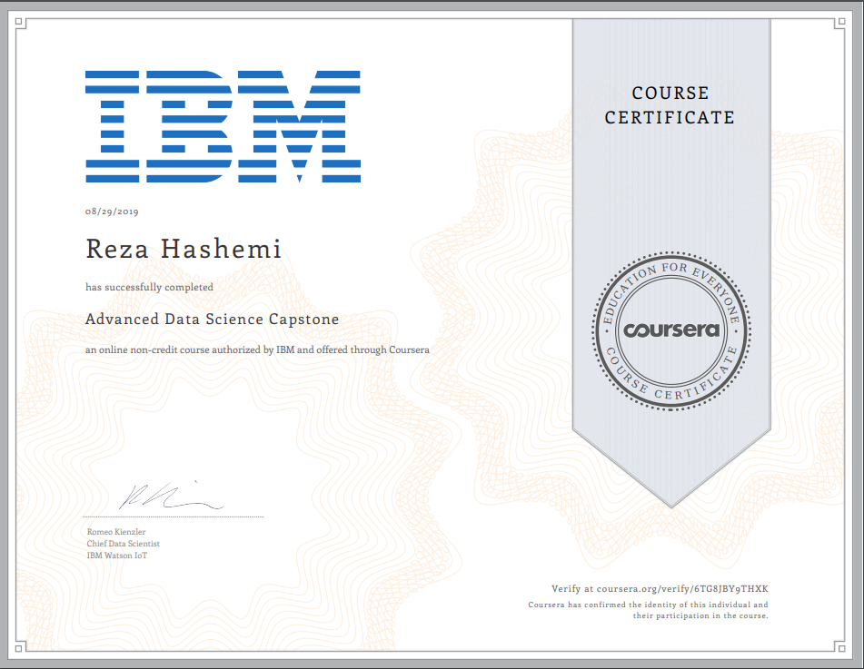

 

| Name | Description | Date 
| :- |-------------: | :-:
|Reza Hashemi| IBM Coursera Advanced Data Science Capstone.  | on 28th of August 2019 |

---

- - - 

# My Peer-graded Assignment: Project Asset Submission of Week 4

# I have submitted a list of IBM Watson Studio Notebooks above kindly which are my data product.
